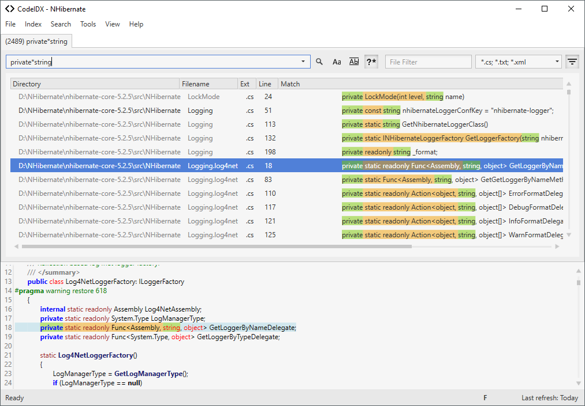

# CodeIDX - A Source Code Indexer

This tool indexes source code using Lucene. It exposes a UI for searching the text of indexed files. 
It has a service subscribed to file system notification changes so that
new files are indexed, modified files are reindexed and deleted files are
removed from the index.

## Features

### Create an index

To create a new index to search click on File.New and the index dialog will show.
Enter a name for the index. The name will be displayed in the title bar when the index is loaded.
Select a location for the index to be created in. The location should be a common location you want to put all your indices in.
Select or enter one or more folders to be indexed. All selected index sources will be merged into a single index.
In the filetypes section input the filetypes you want to index.

### Search in results

To enable search in results, open the options dialog and go to the search menu.
Click "Enable search in results".
A new icon will appear next to the search button when a search has been made.
Click the lock to lock the files currently displayed in the results.
You can remove files from the results first by right clicking them and selecting "Remove File" or pressing Delete.
When files are locked, the next search will only search the locked files.
To update the locked files, unlock and lock again.

### Auto update

To enable Auto Update, in the index menu, check "Auto Update".
When auto update is enabled, any changes made to an indexed folder while CodeIDX is running will automatically be updated in the index.
When a file is deleted, edited, renamed or a new file with an indexed file extension is inserted, the index will be updated accordingly.

WARNING: When a large number of files is updated at the same time, not all changes might be registered. In that case a refresh is recommended.

### Editing

The search results can be directly edited in CodeIDX.
Click Tools and select "Enable Editing" to enable editing.
Select a result and make changes to the file in the preview section.
After your changes press CTRL + S or click the save button to save the changes to the file.

### Wildcard search

To enable wildcard search, click "Use Wildcards" next to the search button.
When wildcard search is enabled, specific wildcards can be used to phrase a more advanced search.

Supported wildcards:

- \* (match zero or more characters)

### Export Results

The search results of the active search can be exported to a text file.
To export the results select "Export Results" in the Tools menu.

### Paging

When executing a search, only a part of the results will be shown to increase the response time.
To load the next results, click the "load next" button in the bottom right corner or click "load all" to load the remaining results.
The next results will also be loaded when scrolling to the end of the displayed results.
While there are more results to be loaded, an asterisk will lead the header of the search tab.

### Shortcuts

- CTRL + F - Jump to search box. When text is selected in the preview, the text is copied to the search box.
- CTRL + SHIFT + F - Open new search and jump to search box. When text is selected in the preview, the text is copied to the search box.
- CTRL + D - Show/hide preview
DELETE - When search result is selected, remove the selected file from the results.
- CTRL + S - When the preview was edited, save the changes.
- CTRL + CLICK ON FILETYPE - Select the clicked filetype and deselect all other filetypes
- CTRL + SHIFT + CLICK ON FILETYPE - Deselect the clicked filetype and select all other filetypes
- ENTER - If setting "Filter file on Enter" is set, the current file is filtered and other files are removed. Otherwise, the file is opened in the default editor.

## Contributing

### Requirements

* Lucene.NET from http://lucenenet.apache.org/download.cgi
* Log4Net from 
* .NET Framework 4.5 or greater

### Setting Up to Build

1. Clone the repo from CodePlex (http://codeidx.codeplex.com/)
	a. If you want, you can create a Fork first
2. Install Visual Studio 2013 (or later)
3. Launch VS
4. Open CodeIdx.SLN
5. Tools / NuGet Package Manager / Manage NuGet packages for solution...
6. Click Restore to add all the missing packages (packages directory not committed to Git)
7. Change the certificate used to sign the EXE:
	a. Right click on CodeIDX in the solution, select Properties
	b. Go to Signing
	c. Click Create Test Certificate
	d. Create a password
	e. Save the project file.
8. Build and run the solution

### Testing

1. Select File / New to create a new index
2. Point at a directory containing sources.  
3. Click OK
4. Index will be built
5. Try searching using text box at top.

### Directories

- Helpers
- Properties
- Services - background tasks running in the EXE.
- Settings
- ViewModels
- Views

## Author & Acknowledgements

Erik Kuhlig is author and copyright holder of the [original project](https://archive.codeplex.com/?p=codeidx).

UI has been updated by [@benruehl](https://github.com/benruehl) using [AdonisUI](https://github.com/benruehl/adonis-ui).

Thanks for testing and feedback goes to:
René Rönisch,
Benjamin Klawitter,
Lars Hildebrand,
Kamil Pietraszko
